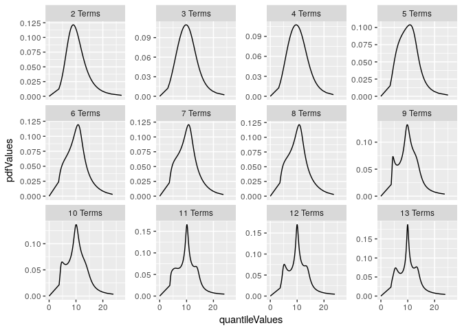
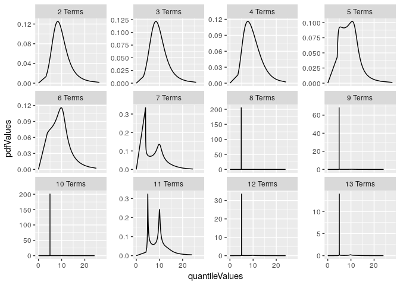

README
================
Isaac J. Faber

<!-- README.md is generated from README.Rmd. Please edit that file -->
### The R Metalog Distribution

This repo is a working project for an R package that generates functions for the metalog distribution. The metalog distribution is a highly flexible probability distribution that can be used to model data without traditional parameters.

### Metalog Background

In economics, business, engineering, science and other fields, continuous uncertainties frequently arise that are not easily- or well-characterized by previously-named continuous probability distributions. Frequently, there is data available from measurements, assessments, derivations, simulations or other sources that characterize the range of an uncertainty. But the underlying process that generated this data is either unknown or fails to lend itself to convenient derivation of equations that appropriately characterize the probability density (PDF), cumulative (CDF) or quantile distribution functions.

The metalog distributions are a family of continuous univariate probability distributions that directly address this need. They can be used in most any situation in which CDF data is known and a flexible, simple, and easy-to-use continuous probability distribution is needed to represent that data. Consider their [uses and benefits](http://www.metalogdistributions.com/usesbenefits.html). Also consider their [applications](http://www.metalogdistributions.com/applicationsdata.html) over a wide range of fields and data sources.

This repository is a complement and extension of the information found in the [paper published](http://pubsonline.informs.org/doi/abs/10.1287/deca.2016.0338) in Decision Analysis and the [website](http://www.metalogdistributions.com/)

### Using the package

To install the package from this repository use the following:

``` r
library(devtools)
install_github('isaacfab/RMetalog')
```

``` r
library(RMetalog)
```

Once the package is loaded you start with a data set of continuous observations. For this repository we will use an example of fish size measurements from the Pacific Northwest. This data set is illustrative to demonstrate the flexibility of the metalog distribution. The data frame is installed with the package.

``` r
data("fishSize")
summary(fishSize)
#>     FishSize    
#>  Min.   : 3.00  
#>  1st Qu.: 7.00  
#>  Median :10.00  
#>  Mean   :10.18  
#>  3rd Qu.:12.00  
#>  Max.   :33.00
```

The base function for the package is the call of the rMetalog distribution

``` r
rMetalog()
```

This function takes several inputs:

-   data - vector of numeric data
-   probs - probability quantiles (optional but must be the same length as data vector)
-   step\_len - size of steps to evaluate the distribution (some value between 0 and 1)
-   boundedness - unbounded, semi-bounded upper, semi-bounded lower or bounded: only values u, su, sl and b are accepted (defaults to 'u')
-   bounds - the values of the bounds if upper, lower or bounded (must be two numeric values lower and upper)
-   term\_limit - the number of metalog terms to evaluate (must be an integer greater than or equal to 3 and less than 30, defaults to 3)

In order to create a metalog distribution use the function and assigned the output to a variable.

``` r
#use a smaller subset for performance
mysample <- fishSize[sample(1:nrow(fishSize), 250,replace=FALSE),]
myMetalog <- rMetalog(mysample,
                      step_len = .01,
                      bounds=0,
                      boundedness = 'sl',
                      term_limit = 17)
#> [1] "Building the metalog distributions now"
#> [1] "Building distribution functions and samples"
```

This function returns a list with the following components for use

-   quantiles for each term (M matrix) where the term is the following interger so M4 is the fourth term
-   probability for each step (m matrix) where the term is the following interger so m4 is the fourth term
-   a matrix for calculation of probabilities
-   a validation vector on the results of each term evaluated

Evalute the list contents

``` r
str(myMetalog)
```

The validation check is useful to see what terms returned a valid density function

``` r
myMetalog$Validation
```

You can now plot some of the results using

``` r
myMetalog$GridPlotPDF
```



``` r
myMetalog$GridPlotCDF
```



As this package evolves this list will include some additional functionality

-   pannel plot function
-   cdf function
-   sampling function
