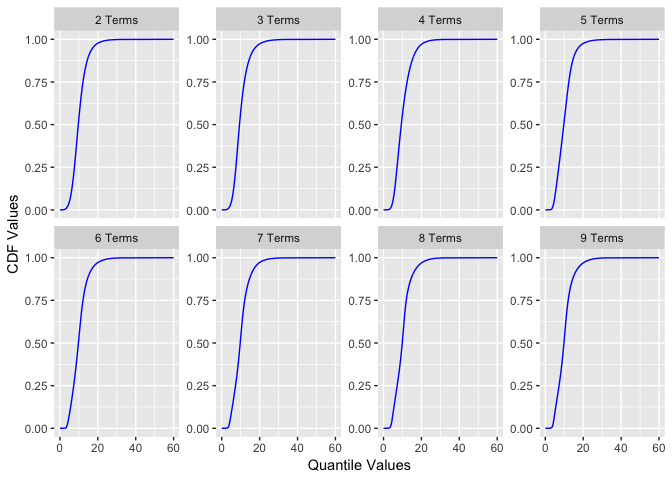
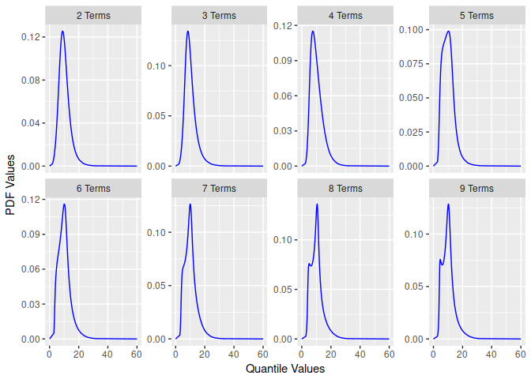

README
================
Isaac J. Faber

<!-- README.md is generated from README.Rmd. Please edit that file -->
### The R Metalog Distribution

This repo is a working project for an R package that generates functions for the metalog distribution. The metalog distribution is a highly flexible probability distribution that can be used to model data without traditional parameters.

### Metalog Background

In economics, business, engineering, science and other fields, continuous uncertainties frequently arise that are not easily- or well-characterized by previously-named continuous probability distributions. Frequently, there is data available from measurements, assessments, derivations, simulations or other sources that characterize the range of an uncertainty. But the underlying process that generated this data is either unknown or fails to lend itself to convenient derivation of equations that appropriately characterize the probability density (PDF), cumulative (CDF) or quantile distribution functions.

The metalog distributions are a family of continuous univariate probability distributions that directly address this need. They can be used in most any situation in which CDF data is known and a flexible, simple, and easy-to-use continuous probability distribution is needed to represent that data. Consider their [uses and benefits](http://www.metalogdistributions.com/usesbenefits.html). Also consider their [applications](http://www.metalogdistributions.com/applicationsdata.html) over a wide range of fields and data sources.

This repository is a complement and extension of the information found in the [paper published](http://pubsonline.informs.org/doi/abs/10.1287/deca.2016.0338) in Decision Analysis and the [website](http://www.metalogdistributions.com/)

### Using the package

To install the package from this repository use the following:

``` r
library(devtools)
install_github('isaacfab/RMetalog')
```

Once the package is loaded you start with a data set of continuous observations. For this repository, we will load the library and use an example of fish size measurements from the Pacific Northwest. This data set is illustrative to demonstrate the flexibility of the metalog distribution as it is bi-modal. The data is installed with the package.

``` r
library(rmetalog)
data("fishSize")
summary(fishSize)
#>     FishSize    
#>  Min.   : 3.00  
#>  1st Qu.: 7.00  
#>  Median :10.00  
#>  Mean   :10.18  
#>  3rd Qu.:12.00  
#>  Max.   :33.00
```

The base function for the package to create distributions is:

``` r
metalog()
```

This function takes several inputs:

-   x - vector of numeric data
-   term\_limit - integer between 3 and 30, specifying the number of metalog distributions, with respective terms, terms to build (default: 13)
-   bounds - numeric vector specifying lower or upper bounds, none required if the distribution is unbounded
-   boundedness - character string specifying unbounded, semi-bounded upper, semi-bounded lower or bounded; accepts values u, su, sl and b (default: 'u')
-   term\_lower\_bound - (Optional) the smallest term to generate, used to minimize computation must be less than term\_limit (default is 2)
-   step\_len - (Optional) size of steps to summarize the distribution (between 0.001 and 0.01, which is between approx 1000 and 100 summarized points). This is only used if the data vector length is greater than 100.
-   probs - (Optional) probability quantiles, same length as x

Here is an example of a lower bounded distribution build.

``` r
my_metalog <- metalog(fishSize$FishSize,
                       term_limit = 9,
                       term_lower_bound = 2,
                       bounds=c(0,60),
                       boundedness = 'b',
                       step_len = 0.01)
```

The function returns an object of class `rmetalog` and `list`. You can get a summary of the distributions using `summary`.

``` r
summary(my_metalog)
#>  -----------------------------------------------
#>  Summary of Metalog Distribution Object
#>  -----------------------------------------------
#>  
#> Parameters
#>  Term Limit:  9 
#>  Term Lower Bound:  2 
#>  Boundedness:  b 
#>  Bounds (only used based on boundedness):  0 60 
#>  Step Length for Distribution Summary:  0.01 
#>  Method Use for Fitting:  any 
#>  
#> 
#>  Validation and Fit Method
#>  term valid method
#>     2   yes    OLS
#>     3   yes    OLS
#>     4   yes    OLS
#>     5   yes    OLS
#>     6   yes    OLS
#>     7   yes    OLS
#>     8   yes    OLS
#>     9   yes    OLS
```

You can also plot a quick visual comparison of the distributions by term.

``` r
plot(my_metalog)
#> $pdf
```


    #> 
    #> $cdf



Once the distributions are built, you can create `n` samples by selecting a term.

``` r
s<-rmetalog(my_metalog,n=1000,term=9)
hist(s)
```



You can also retrieve quantile, density, and probability values similar to other R distributions.

``` r
qmetalog(my_metalog, y = c(0.25, 0.5, 0.75), term = 9)
#> [1]  7.240623  9.840139 12.063061
```

probabilities from a quantile.

``` r
pmetalog(my_metalog, q = c(3,10,25), term = 9)
#> [1] 0.00195673 0.52005826 0.99226703
```

density from a quantile.

``` r
dmetalog(my_metalog, q = c(3,10,25), term = 9)
#> [1] 0.004489508 0.126724357 0.002264396
```

As this package is under development, any feedback is appreciated! Please submit a pull request or issue if you find anything that needs to be addressed.
